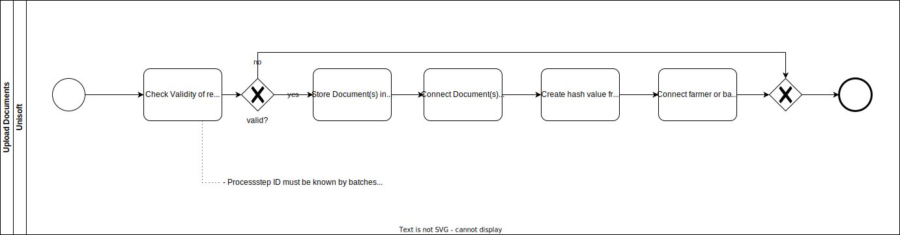

[[chapter-runtime-view]]
:docinfo: shared
:toc: left
:toclevels: 3
:sectnums:
:copyright: Apache License 2.0

= Runtime View

*Contents*

- 1 General Component Communication
- 2 Transaction related schemes and definitions
- 3 Use Cases and process flows

== General Component Communication

All inter-component communication is carried out using JSON messages.
This communication occurs either through direct REST interactions from the frontend to the BFF (Backend for Frontend), or for inter-service communication, via an AMQP messaging queue via a broker instance, as provided by https://www.rabbitmq.com/[RabbitMQ].

== Transaction related schemes and definitions

This Chapter outlines all available APIs in the following Order:

1. The Blockchain Connector which accepts AMQP messages related to the process.
2. The Api exposed through the BFF which the Unisoft Frontend uses to query for data.

=== AMQP specific messaging interfaces and API

The Entity Management SVC and Process SVC serves as a Bridge and allows the following AMQP Endpoints.

==== Batch API
|===
| *ExportToken Controller* | Path | Description
| CREATE | `/batches/create` | Create a new coffee batch
| CREATE_HARVESTS | `/batches/create-harvests` | Create new harvest batches
| CREATE_COMBINED_HARVESTS | `/batches/create-combined-harvests` | Create new Harvest batch to multiple plots of land
| READ_BY_ID  | `/batches/read-by-id` | Read a batch by its ID
| READ_BY_ID_RELATED | `/batches/read-by-id-related` | Read all coffee batches that are related to the coffee batch
| READ_EXPORT | `/batches/read-export` | Read batch file with all batch information and all previous and next batches
|===

==== Company API
|===
| *ExportToken Controller* | Path | Description
| CREATE | `/companies/create` | Create a new company
| READ_BY_ID | `/companies/read-by-id` | Read a company by its ID
| READ_COMPANIES | `/companies/read` | Read all companies
| READ_BATCHES  | `/companies/read-batches` | Read all batches by company
|===

==== Cultivation API
|===
| *ExportToken Controller* | Path | Description
| CREATE | `/cultivations/create` | Create a new cultivation
| READ_ALL | `/cultivations/read-all` | Read all cultivations
|===

==== Plots of Land API
|===
| *ExportToken Controller* | Path | Description
| CREATE | `/plots-of-land/create` | Create a new plot of land
| READ_ALL | `/plots-of-land/read-all` | Read all plots of land
| READ_BY_ID | `/plots-of-land/read-by-id` | Read a plot of land by ID
| UPDATE_BY_ID | `/plots-of-land/update-by-id` | Update a plot of land by ID
| CREATE_BY_ID_PROOF | `/plot-of-lands/create-by-id-proof` | Create a new proof by plot of land ID
| READ_BY_ID_PROOFS | `/plot-of-lands/read-by-id-proofs` | Read all proofs by plot of land ID
|===

==== User API
|===
| *ExportToken Controller* | Path | Description
| CREATE | `/users/create` | Create a new user
| READ_ALL | `/users/read-all` | Read all users
| READ_BY_ID | `/users/read-by-id` | Read a user by ID
| UPDATE_BY_ID | `/users/update-by-id` | Update a user by ID
| CREATE_FARMER | `/users/create-farmer` | Create a new farmer
| READ_FARMER_BY_COMPANY_ID | `/users/read-farmer-by-company-id` | Read a farmer by company ID
|===

==== Document API
|===
| *ExportToken Controller* | Path | Description
| ADD_PROCESS_STEP | `/docs/process-step/add` | Create a new process step
| ADD_FARMER | `/docs/farmer/add` | Create a new farmer document
| UPDATE_FARMER | `/docs/farmer/update` | Update a farmer document
| DELETE_FARMER  | `/docs/farmer/delete` | Delete a farmer document
|===

==== Import API
|===
| *ExportToken Controller* | Path | Description
| IMPORT_MASTER_DATA | `/import` | Create a new import
|===

=== REST specific messaging interfaces and API

The BFF serves as a Bridge for the frontend and allows the following REST Endpoints:

==== Batches API
|===
| *ExportToken Controller* | Path | Description
| POST | `/batches` | Create new coffee batches
| POST | `/batches/harvests` | Create new harvest batches
| POST | `/batches/harvests/combined` | Create new harvest batch to multiple plots of land
| GET | `/batches/+{id}+` | Get coffee batch by their ID
| GET | `/batches/+{id}+/related` | Get all coffee batches that are related to the coffee batch
| GET | `/batches/+{id}+/export` | Export batch file with all batch information and all previous and next batches
|===

==== Companies API
|===
| *ExportToken Controller* | Path | Description
| POST | `/companies` | Create a new company
| GET | `/companies` | Get all companies
| GET | `/companies/+{id}+` | Get company by their ID
| GET | `/companies/+{id}+/batches` | Get all coffee batches of the company
| GET | `/comapnies/+{id}+/farmers` | Get all farmers related to the company
|===

==== Cultivations API
|===
| *ExportToken Controller* | Path | Description
| POST | `/cultivations` | Create a new cultivation
| GET | `/cultivations/sorts` | Get all cultivation sorts
| GET | `/cultivations/qualities` | Get all cultivation qualities
| GET | `/cultivations` | Get all cultivations
| GET | `/cultivations/commodities` | Get all cultivation commodities
|===

==== Plots of Land API
|===
| *ExportToken Controller* | Path | Description
| POST | `/pols` | Create a new Plot of Land
| POST | `/pols/+{id}+/proofs` | Create a proof for a plot of land
| GET | `/pols/+{id}+/proofs` | Get all proofs of a plot of land
| GET | `/pols` | Get all plots of land of a farmer
| GET | `/pols/+{id}+` | Get plot of land by ID
| PATCH | `/pols/+{id}+` | Create or update the seeding for a plot of land
|===

==== Users API
|===
| *ExportToken Controller* | Path | Description
| POST | `/users` | Create a new user
| POST | `/users/farmers` | Create a new farmer
| POST | `/pols/+{id}+/docs` | Create a new document for a farmer
| GET | `/users` | Get all users
| GET | `/users/+{id}+` | Get user by their ID
| PATCH | `/users/+{id}+` | Update a user
| PATCH | `/users/+{id}+/docs/+{docRef}+` | Update a document of a farmer
| DELETE | `/users/+{id}+/docs/+{docRef}+` | Delete a document of a farmer
|===

==== Process Steps API
|===
| *ExportToken Controller* | Path | Description
| POST | `/process-steps/+{id}+/docs` | Create a new document for process steps
|===

==== Import API
|===
| *ExportToken Controller* | Path | Description
| POST | `/import` | Import master data from an excel file
|===

== Use Cases and process flows

In the Unisoft architecture, an organized series of steps is followed to facilitate activities such as harvesting, processing, add plots of land and more. This is illustrated in the image below.

=== Login/Register

image:images/runtime-view/login-flowchart.svg[]

|===
| *Nr.* | Step | Description
| *1* | *User:* Insert credentials in login page | Add username and password.
| *2* | *Unisoft:* Check validity of request | Accountname must be known.
| *3* | *Unisoft:* Send response to user | Login to Unisoft.
|===

=== Harvesting

image:images/runtime-view/harvesting-flowchart.svg[]

|===
| *Nr.* | Step | Description
| *1* | *User:* Open Page | Open page to 'Add Harvest'.
| *2* | *Unisoft:* Get List of Plots of Land by select one Process Owner | Lists all Plots of Land by provided Process Owner.
| *3* | *User:* Enter Harvest Data | Add Plots of Land, Date, Weight, Recipient and Author of Entry.
| *4* | *Unisoft:* Check Validity of Request | All Values must be selected and IDs are known.
| *5* | *Unisoft:* Store Harvest(s) in DB and Blockchain | Create new Harvest.
| *6* | *Unisoft:* Merge multiple inputs into one coffee batch | The process name is changed to merge.
|===

=== Processing

image:images/runtime-view/processing-flowchart.svg[]

|===
| *Nr.* | Step | Description
| *1* | *User:* select Batch/Batches to update and open Site to 'Add Process' | Get List of valid coffee batches from Database.
| *2* | *User:* Enter Process Data | Add Date, Process name, Process Owner, Author of Entry, EU Info System ID, Weight and Recipient.
| *3* | *Unisoft:* Check Validity of request | All Values must be selected, IDs are known and batch(es) must be 'active'.
| *5* | *Unisoft:* Create Output Coffee Batches | Create new Batch(es).
| *6* | *Unisoft:* Store Process Data | Store Batch(es) in DB and Blockchain.
| *7* | *Unisoft:* Set Input Coffee Batches as "inactive" | All selected Batch(es) get status 'inactive'
| *8* | *Unisoft:* Send Response | Get all new Batch(es).
|===

=== Create Company

image:images/runtime-view/create-company-flowchart.svg[]

|===
| *Nr.* | Step | Description
| *1* | *User:* First-Time Login | Opens page 'Add Company'.
| *2* | *User:* Insert Profile Data for Company  | Add name of Company, Address and Additional Information (optional).
| *4* | *Unisoft:* Check Validity of Request | All Values must be selected and Company name must be new.
| *5* | *Unisoft:* Create new BC-Account | Store Company in Blockchain.
| *6* | *Unisoft:* Send Response | Get new Company.
|===

=== Create User/Farmer

image:images/runtime-view/create-user-farmer.svg[]

|===
| *Nr.* | Step | Description
| *1* | *User:* open Site "Create User/Farmer" in Company Overview | Opens page.
| *2* | *User:* Insert Date for User or Farmer | Add Name, Address, email, phone number, local farmer ID (by Farmer), employee ID (by user), additional Information (optional) and Documents (optional, by farmer).
| *4* | *Unisoft:* Check Validity of Request | All Values must be selected and farmer or user must be new.
| *5* | *Unisoft:* Create new Farmer or User | Create new Farmer or User ID and store profile in Database.
| *6* | *Unisoft:* Send Response | Get new Farmer or User.
|===

=== Edit Farmer

|===
| *Nr.* | Step | Description
| *1* | *User:* open Site "Farmer Detail View" in Company Overview | Opens page.
| *2* | *User:* Insert Data for Farmer | Edit Name, Address, email and phone number.
| *4* | *Unisoft:* Check Validity of Request | Farmer must be known.
| *5* | *Unisoft:* Edit Farmer  | Edit Farmer  and store profile in Database.
| *6* | *Unisoft:* Send Response | Get edited Farmer.
|===

=== Add Documents to Farmer or Batches

|===
| *Nr.* | Step | Description
| *1* | *User:* open Page 'Create Farmer' or 'Add Process' | Upload Documents.
| *2* | *Unisoft:* Check Validity of Request | Processstep ID must be known (by batch) and at least one Document is provided.
| *3* | *Unisoft:* Store documents in DB | Create new Farmers and add them in Database.
| *4* | *Unisoft:* Create hash value from Document(s) and store it on BC | Store data in Blockchain.
|===

=== Import Farmer

|===
| *Nr.* | Step | Description
| *1* | *User:* open Site "Company" and click button "Import Data"| Upload Excel Documents.
| *2* | *Unisoft:* Store new Farmers in DB | Created new Farmers in Database.
| *3* | *Unisoft:* Update DB | Database will be updated and new Farmers are implemented.
|===

=== Add Plot of Land to Farmer

image:images/runtime-view/add-plot-of-land-flowchart.svg[]

|===
| *Nr.* | Step | Description
| *1* | *User:* open Site to "Plot of Land" | Opens page.
| *2* | *User:* Insert Plot of Land Data | Add Farmer, Region, Description, Sort of Palm Oil, Quality (optional), Geo Data, national Plot of Land ID, Local Plot of Land ID and Proofs (optional)
| *3* | *Unisoft:* Check Validity of request | All Values must be selected, Farmer ID must be known and Geo Data must have realistic values.
| *4* | *Unisoft:* Store Plot of Land data in DB and Blockchain | Create new Plot of Land ID and link to Farmer.
| *5* | *Unisoft:* Add Proof to Plot of Land | When proofs exists, add them to Plot of Land
| *6* | *Unisoft:* send response to user | Get Plot of Land.
|===

=== Add/Update Proof to Plot of Land

|===
| *Nr.* | Step | Description
| *1* | *Unisoft:* Check Validity of request | Plot of Land ID must be known and Proof of Freedom from deforestation (.pdf) or Proof of Ownership (.pdf) must be provided.
| *2* | *Unisoft:* Store Proof (.pdf) in file system | Store in Database to the Plot of Land.
| *3* | *Unisoft:* Create hash value from Proof and store it on BC | Store Proofs in Blockchain.
|===
