[[chapter-tutorial]]
:docinfo: shared
:toc: left
:toclevels: 3
:sectnums:
:copyright: Apache License 2.0

= Tutorial

This chapter offers a detailed, step-by-step guide for setting up the components of the {projectName} project.
Designed to provide clear instructions and essential information, this tutorial aims to ensure a smooth and efficient installation process.
Follow along to get your application up and running with ease.

== Create New Farmer

To create a new farmer as a company, please follow these steps. +
In the company view, click on the “Create Employee/Farmer” button.

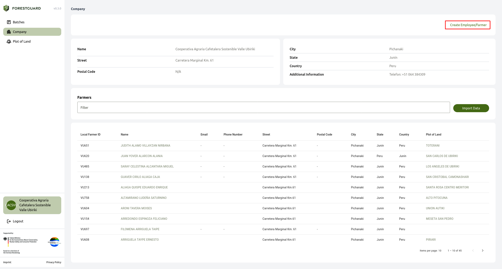

In the next view, select the explicit Create-Farmer dialog via the “Farmer” button at the top right.

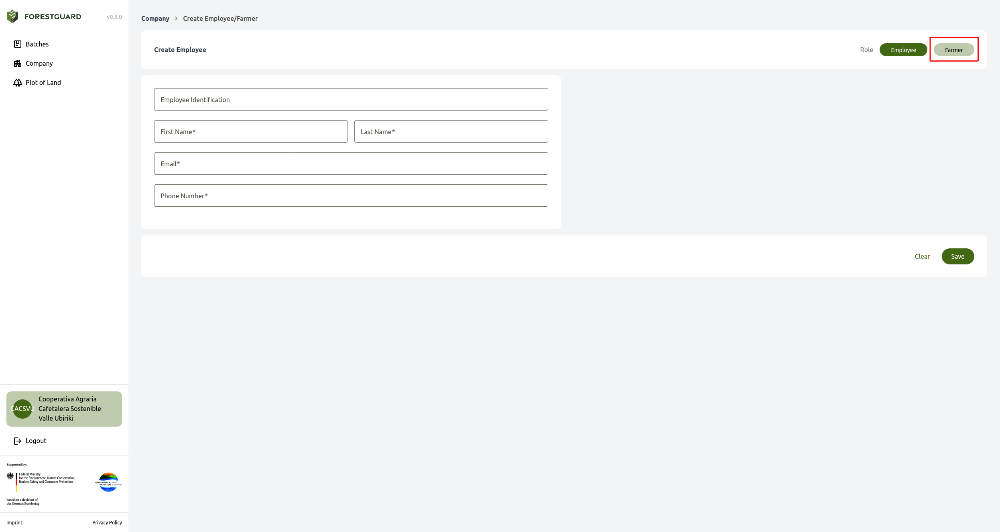

Fill in the personal data. Mandatory fields are marked with an asterisk.

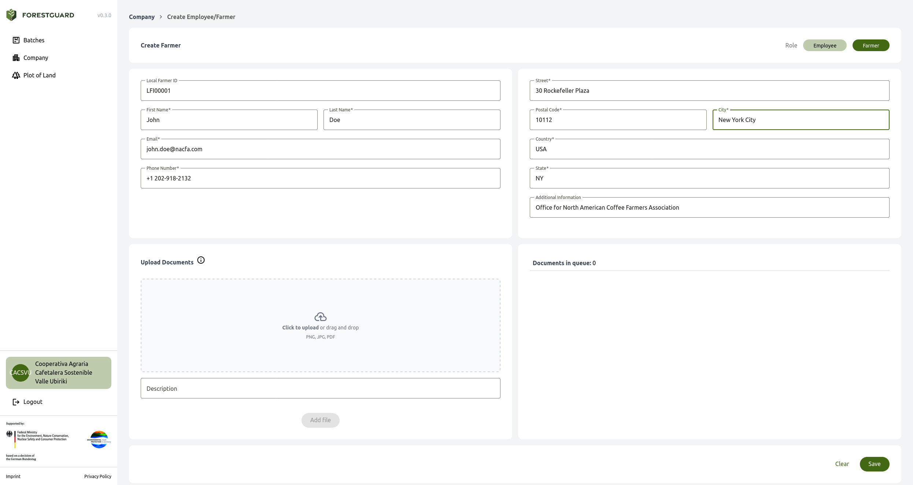

To upload an optional farmer document, click on the grayed-out “Click to upload” field and select the desired document in the file explorer that opens. Optionally add a description to the document. Then confirm by clicking the “Add file” button.
Alternatively, you can also use the “drag & drop” function.

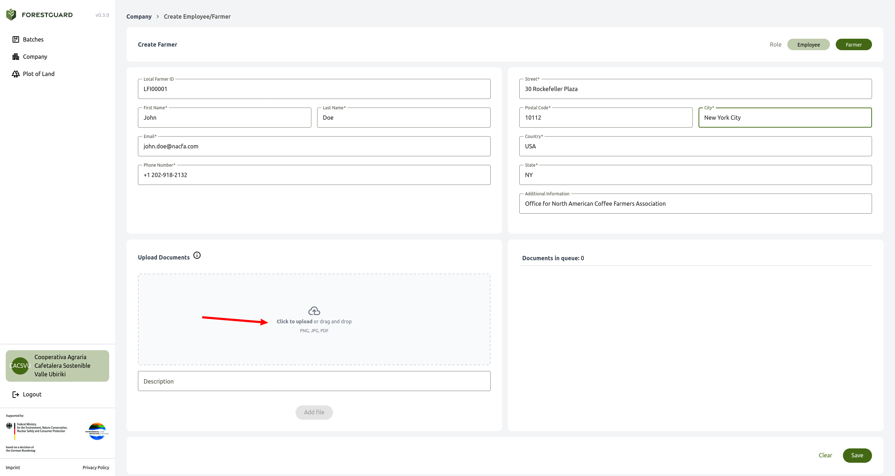

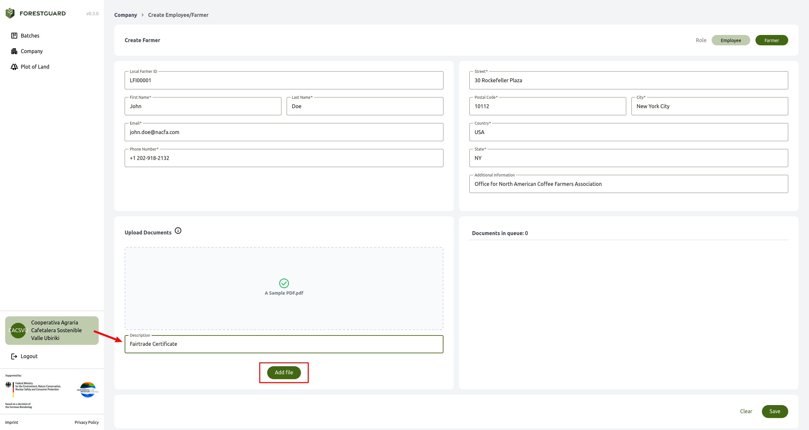

Confirm the complete creation by clicking on “Save”. +
After successful creation, you will be redirected to the details page of the newly created farmer.

image::images/tutorial/Tutorial-1-Create-Farmer-6.png[]

== Create New Plot of Land

To create a new plot of land, select “Plot of Land” from the left side navigation menu to access the add plot of land view.

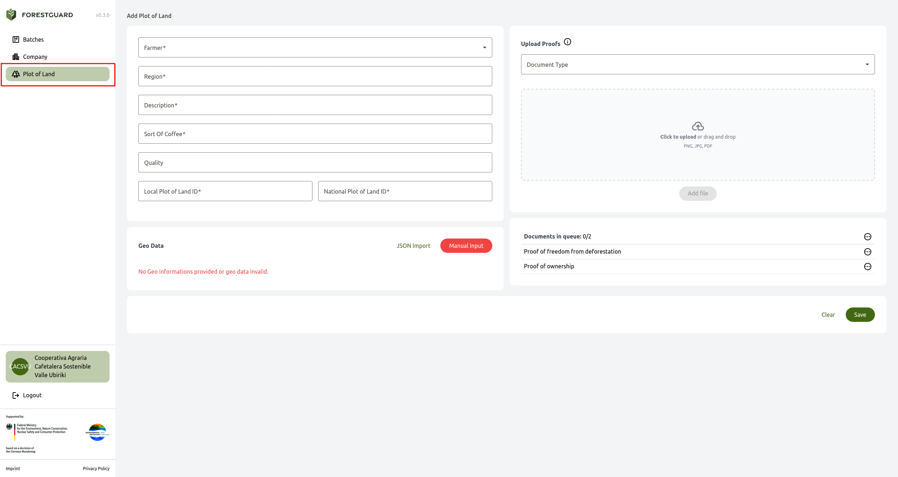

Fill in all non-optional fields (marked with *). +
The form field “Process Owner” can be selected from a drop-down menu. If the drop-down list is too large, the entries in the drop-down menu can be filtered by starting to enter the term you are looking for into the field. +
The sort can be selected from a drop-down menu, but can also be entered freely and anew.
The same applies to cultivation quality.

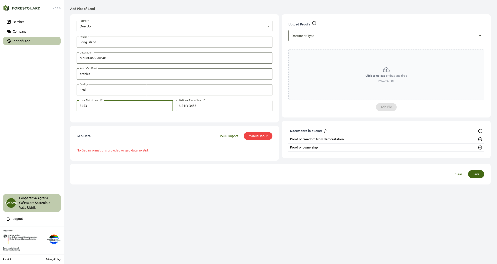

Add the coordinates of the plot of land. These can be imported directly (copy & paste of a JSON) or entered via a guided menu. Both WGS and UTM inputs are available. The coordinates of the plot of land can be entered as a point, multipoint, polygon or multi-polygon.

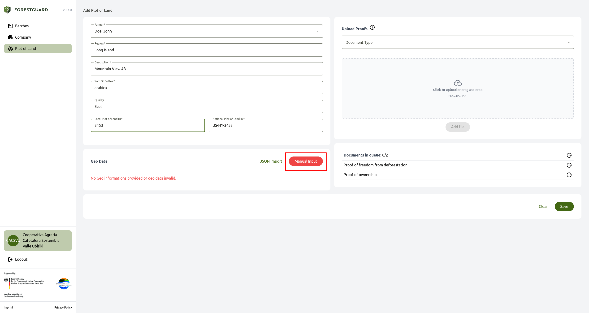

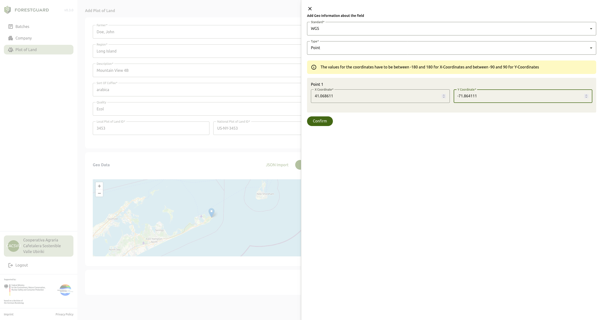

Deforestation and ownership certificates can also be added as documents. To do this, select the appropriate type from the dropdown and then add the document by clicking on the file explorer or using drag & drop and confirm with “Add file”.

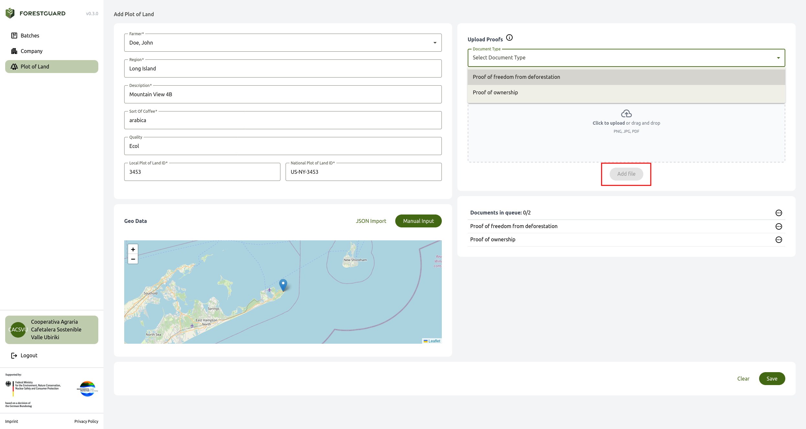

As soon as a document of a type has been added, this is marked with a green tick.

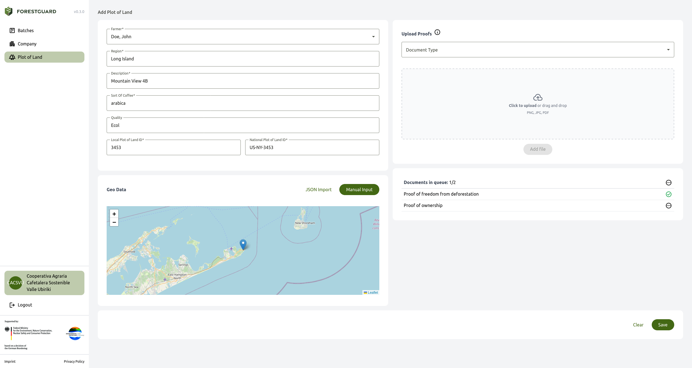

You can add both document types, only one of the two or none at all. +
The plot of land creation is completed by clicking on “Save”. +
After successful creation, you will be redirected to the details page of the plot of land.

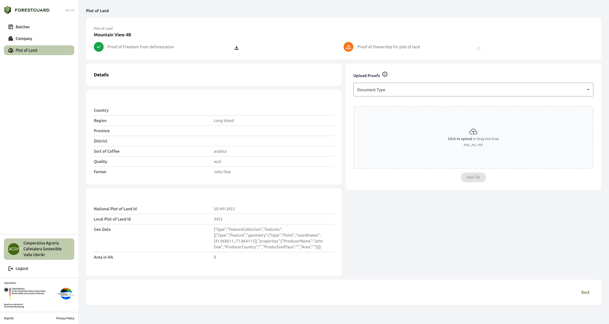

== Create Harvest

To create a batch of a harvested field, first select “Batches” from the left side navigation menu to get to the batches overview. +
Then click on the "Add Harvest" button on the top right-hand side.

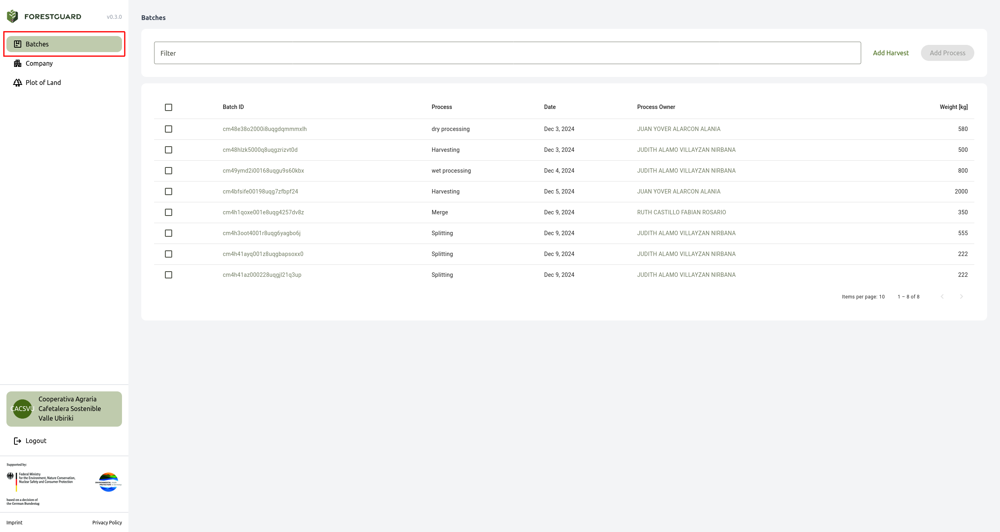

Fill in all fields. +
The form fields “Process Owner”, “Recipient” and “Author of Entry” can be selected from a drop-down menu. If the drop-down list is too large, the entries in the drop-down menu can be filtered by starting to enter the term you are looking for into the field.

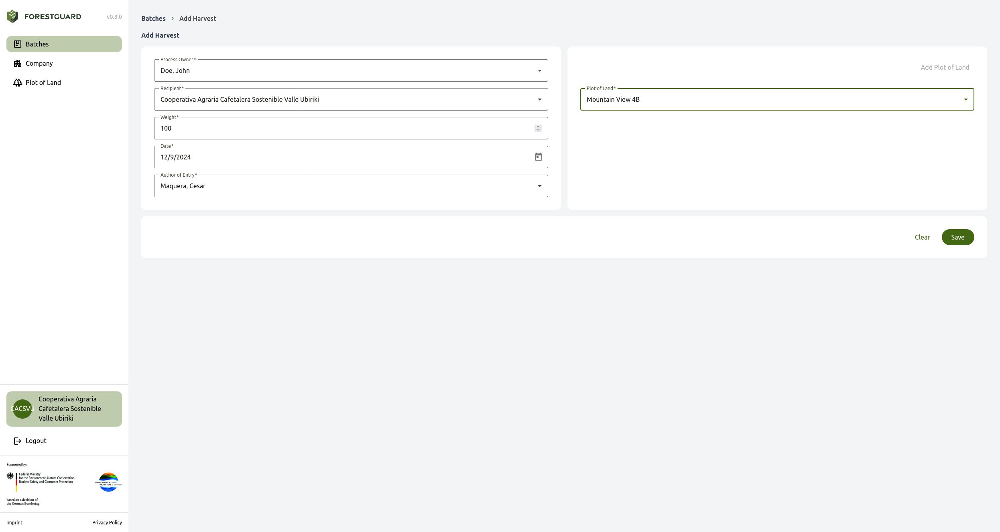

A harvest of several plot of lands can also be created. +
To do this, click on “Add Plot of Land” and select another plot of land from the drop-down menu in the new field. +
Finally, confirm by clicking on “Save”.

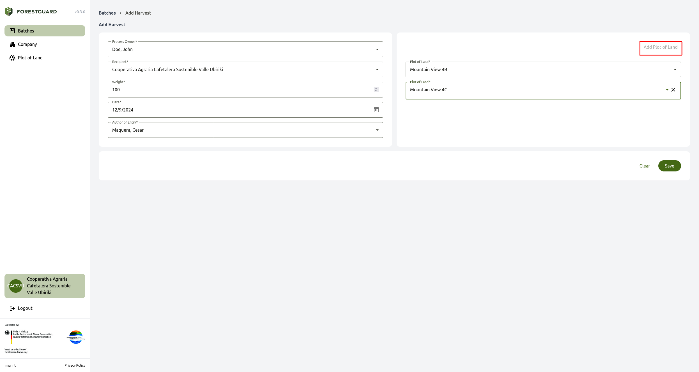

After returning to the batch overview, the new harvest is visible and can be viewed in the batch details view by clicking on it.

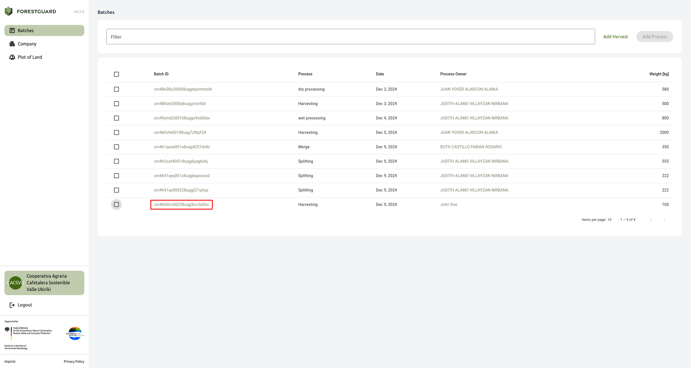

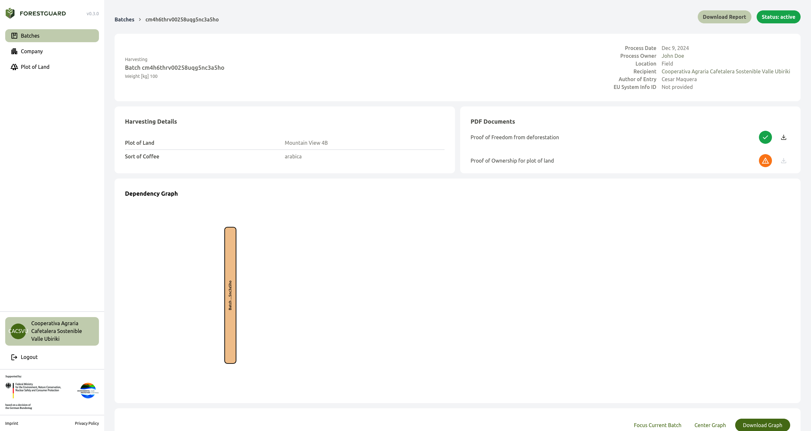

== Add Batch Process

To add a new batch process, first go to the batches overview via the side navigation menu. +
An example of a process would be merging several batches of coffee into one large batch. +
Select the batches that are to be used as input for the new process using the checkboxes. +
Then click on the “Add Process” button.

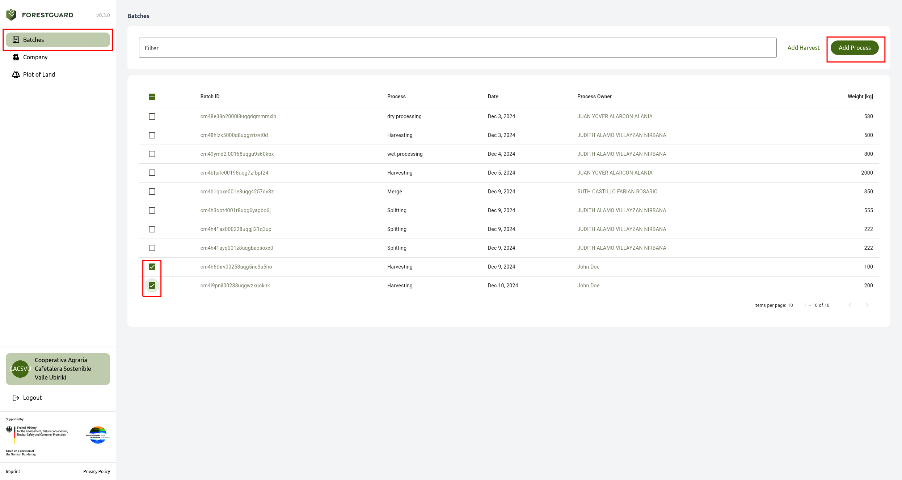

In the new view, the input batches are visible at the bottom left. +
Fill in all data fields. +
The form fields “Process Owner” and “Author of Entry” can be selected from a drop-down menu. If the drop-down list is too large, the entries in the drop-down menu can be filtered by starting to enter the term you are looking for into the field. +
Process Name can be used freely to describe the process. +
The corresponding ID for the EU info system can be added optionally. This can also be done subsequently by creating a new process.

image::images/tutorial/Tutorial-4-Add-Process-2.png[]

Specify the output batches at the bottom left. +
Select the output batch weight and the recipient to be addressed. +
Any number of batches can be added to the output. +

Documents (such as acceptance reports) can optionally be added to the process. To do this, click on the grayed-out “Click to upload” field and select the desired document in the file explorer that opens. Optionally add a description to the document. Then confirm by clicking the “Add file” button.
Alternatively, you can also use the “drag & drop” function. +

Finally, confirm the creation of a process by clicking on the “Save” button.

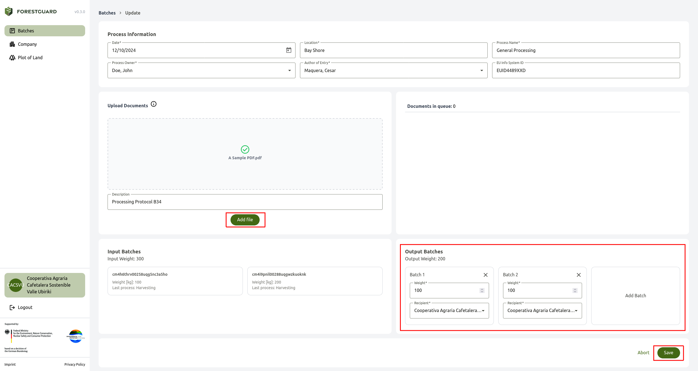

== Use Traceability Graph

The traceability graph displays the history of a batch graphically.
It is intended to show immediately whether a batch is valid. +
It can be accessed by clicking on the batch ID of any batch in the batch overview (in the side navigation menu under “Batches”). +
In the Batch Details View, all information about a batch such as weight, process owner and, for harvests, the corresponding plot of land is displayed. +

In the lower part, the traceability graph is displayed graphically with a focus on the current batch (the current batch is the pale orange box with the black frame). +
Connections between the boxes/batches represent processes. +
Connections to the right represent batch successors. In other words, processing steps that took place after the current batch. Batches on the far right-hand side therefore represent the active batches. The activity of the current batch can also be read via the “Status” display in the top right-hand corner of the view. +
Connections to the left represent batch predecessors. In other words, processing steps that took place before the current batch. Batches on the far left-hand side therefore represent the harvests from which all batches were originally created. +
If both the Proof of freedom from deforestation and the proof of ownership for plot of land are available for a harvest batch, the batch is displayed in green. If only one proof is missing, the batch is displayed in red. +
The validity of all other batches can be derived from the validity of the harvests. +
A processed batch is only valid (and is displayed in green) if all harvests that were predecessors of the batch in question at some point are valid. If only one harvest is not valid, the batch is displayed in red.

You can set the focus on any batch from the graph by clicking on the desired batch box. A new graph is then generated showing all predecessors and successors of the newly selected batch.

If the EU System Info ID is available for a batch, a fingerprint icon is displayed at the top right of the respective batch box.

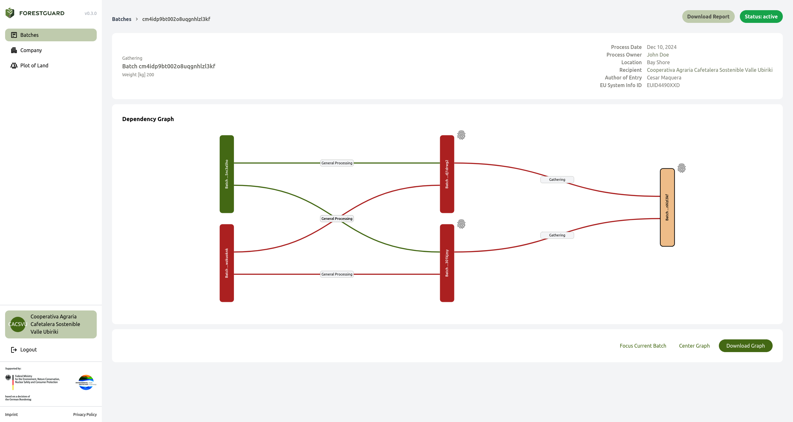

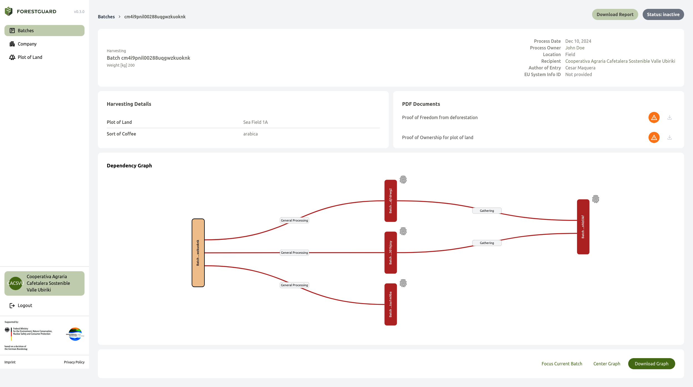

It is also possible to export all data of a batch as JSON or the graph as an image. +
To export data as a JSON file, click on the “Download Report” button in the top right-hand corner. A file is then saved locally on the executing computer. +
To save an image of the current traceability graph, click on the “Download Graph” button in the bottom right-hand corner. An image file is then saved on the executing computer. +
